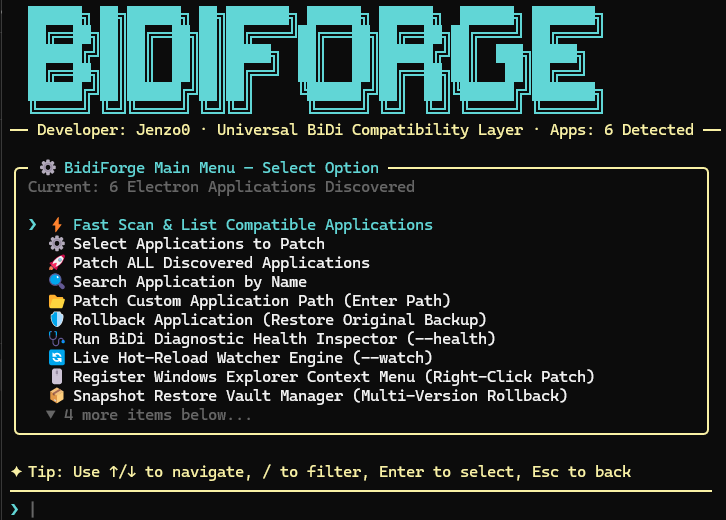
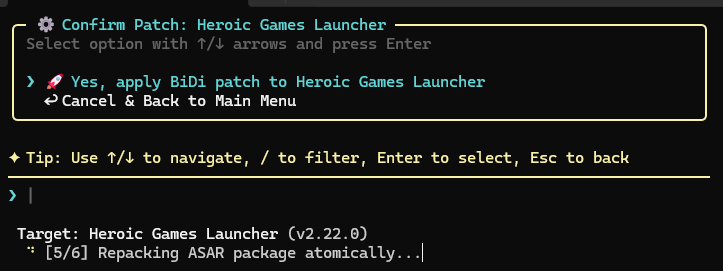
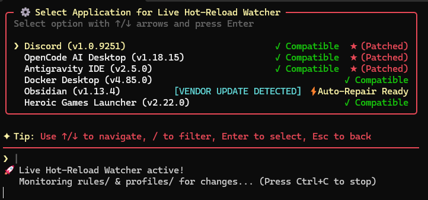
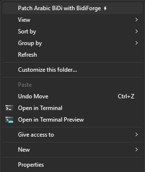

<div align="center">
# 🪬 BidiForge

**Universal BiDi Compatibility Layer for Electron Applications**

[](https://github.com/Jenzo0/BidiForge/releases)
[](https://nodejs.org/)
[](https://microsoft.com/windows)
[](LICENSE)
[](CONTRIBUTING.md)

*A powerful Windows CLI tool that patches Electron desktop applications to render Arabic & RTL text correctly — with automated backup, ASAR integrity validation, and instant rollback.*

[**Getting Started**](#-quick-start) · [**Screenshots**](#-interface-screenshots--features) · [**Features**](#-features) · [**Compatibility**](#-compatibility-status) · [**Usage**](#-usage) · [**Architecture**](#-architecture)

</div>

---

## 📸 Interface Screenshots & Features

<div align="center">

| 🪬 Interactive Main Menu (TUI) | ⚡ Confirmation & Safe Repack Engine |
|:---:|:---:|
|  |  |
| **🎨 Live Hot-Reload Watcher** | **🖱️ Windows Explorer Integration** |
|  |  |

</div>

### 🌟 Key Feature Highlights

- **🪬 Hermes Agent TUI**: Responsive header auto-windowing, arrow-key cursor navigation, dynamic card rendering, and zero scrollback repetition.
- **⚡ Safe Multi-Stage Repacker**: ASAR extraction, ES module & Webpack syntax validation, and Windows file-lock resilience (`safeRename`).
- **🎨 Live Hot-Reload Watcher**: Real-time configuration watcher with customizable themes (`cyberpunk`, `matrix`, `dracula`, `amber`, `nordic`, `monokai`) for background auto-patching.
- **🖱️ Windows Shell Integration**: One-click right-click context menu integration for instant application patching directly from File Explorer.

---

## 🌍 The Problem

Over **70% of modern desktop applications** are built on Electron — Discord, VS Code, Obsidian, Slack, Notion, and hundreds more. But most of them **fail** at rendering Right-to-Left (RTL) and Bidirectional (BiDi) text out of the box.

For **400+ million** Arabic, Hebrew, Persian, and Urdu speakers, this means:

| Without BidiForge | With BidiForge |
|---|---|
| `م ر ح ب ا` disconnected letters | `مرحبا` properly connected Arabic |
| `!dlrow ,olleH مرحبا` reversed mixed text | `مرحبا, Hello world!` natural BiDi flow |
| Broken UI alignment in RTL contexts | Contextual RTL layout and text direction injection |

**BidiForge surgically patches these apps at the ASAR level** — no source code access needed, no app rebuilds, no waiting for upstream fixes.

---

## ✨ Features

<table>
<tr>
<td width="50%">

### 🔍 Smart Auto-Discovery
Automatically scans your entire system and detects all installed Electron applications with version information.

### 💉 Surgical ASAR Patching
Injects optimized RTL CSS + BiDi JavaScript directly into the app's ASAR archive using a subtree MutationObserver engine — zero DOM polling.

### 🛡️ Safe Update Detection
Detects when an app vendor pushes an update that overwrites your patch and auto-repairs it instantly.

### 📦 Multi-Version Snapshot Vault
Create and restore multiple versioned snapshots of any app — like git for your patches.

</td>
<td width="50%">

### 🔥 Live Hot-Reload Watcher
Watch mode that automatically re-patches apps in real-time as configurations change.

### 🖱️ Windows Explorer Integration
Right-click any Electron app folder in Explorer → "Patch with BidiForge".

### 🩺 Diagnostic Health Inspector
Full diagnostic suite with scoring to verify patch integrity, structure compatibility, and BiDi injection status.

### 🎨 Themeable Hermes Agent TUI
Beautiful terminal interface with arrow-key navigation, animated spinners, dynamic card rendering, and multiple color themes.

</td>
</tr>
</table>

---

## 🚀 Quick Start

### Prerequisites
- **Windows 10/11** (x64)
- **[Node.js](https://nodejs.org/)** v16 or higher

### Installation

```bash
# Clone the repository
git clone https://github.com/Jenzo0/BidiForge.git

# Navigate to the project
cd BidiForge

# Install dependencies
npm install

# Launch BidiForge
node index.js
```

Or double-click `BidiForge.bat` for instant launch!

---

## 💡 Usage

### Interactive TUI Mode (Recommended)

```bash
node index.js
```

This launches the **Hermes Agent TUI** — a fully interactive terminal interface with:
- ⬆️⬇️ Arrow key navigation
- 🔍 `/` to search/filter options
- `Space` to toggle multi-select checkboxes
- `Enter` to confirm selection
- `Esc` to go back

### CLI Commands

```bash
# Scan for all installed Electron apps
node index.js scan

# Patch a specific application
node index.js patch discord

# Patch all detected applications
node index.js patch

# Force re-patch (after manual app update)
node index.js repair discord

# Rollback to original (remove patch)
node index.js rollback discord

# Run diagnostic health check
node index.js health

# Start live hot-reload watcher
node index.js watch

# Change color theme
node index.js theme monokai

# Register Windows Explorer right-click menu
node index.js register-shell

# Manage snapshot vault
node index.js vault
node index.js vault restore <snapshot-id>

# Clean temporary files
node index.js cleanup
```

---

## 📱 Compatibility Status

BidiForge uses a universal ASAR injection engine. Application compatibility is categorized as follows:

### Verified & Tested
Applications manually tested and verified in Windows environments:
- **Discord** (v1.0+)
- **OpenCode AI Desktop** (v1.18+)
- **Antigravity IDE** (v2.5+)
- **Obsidian** (v1.13+)
- **Heroic Games Launcher** (v2.22+)
- **Docker Desktop Frontend** (v4.85+)

### Generic Electron Candidates (Potentially Compatible)
- Standard Electron desktop applications (v12–v32) packaged with `resources/app.asar` using CommonJS or ES Module entry points.

### Not Verified / Unsupported
- Non-Electron native applications (Win32, WPF, UWP, C++).
- Electron apps with custom binary obfuscation or non-standard native ASAR headers.

---

## 🎨 Color Themes

BidiForge ships with 6 built-in TUI color themes (`ui/theme.js`):

| Theme Key | Name & Palette Style |
|-----------|----------------------|
| `cyberpunk` | **Cyberpunk Cyan** — Neon cyan borders with gold accents (default) |
| `matrix` | **Neon Emerald Matrix** — Bright green borders with cyan accents |
| `dracula` | **Dracula Purple** — Purple-accented dark theme |
| `amber` | **Gold Amber** — Warm amber borders with cyan accents |
| `nordic` | **Nordic Deep Blue** — Deep blue borders with yellow accents |
| `monokai` | **Monokai Sunset** — Vibrant red/orange borders with yellow title accents |

Switch themes anytime:
```bash
node index.js theme matrix
```

---

## 🏗️ Architecture

BidiForge operates through a multi-stage pipeline:

<details>
<summary><b>Click to view architecture diagram</b></summary>

```
┌──────────────────────────────────────────────────────────┐
│                    BidiForge Engine                       │
├──────────────────────────────────────────────────────────┤
│                                                          │
│   ┌─────────┐    ┌────────────┐    ┌──────────────┐     │
│   │Detector │───▶│ Classifier │───▶│   Injector    │     │
│   │ Engine  │    │  (CJS/ESM) │    │  (CSS + JS)  │     │
│   └─────────┘    └────────────┘    └──────┬───────┘     │
│        │                                   │             │
│        │          ┌────────────┐           │             │
│        └─────────▶│   Backup   │◀──────────┘             │
│                   │   System   │                         │
│                   └──────┬─────┘                         │
│                          │                               │
│                   ┌──────▼─────┐    ┌──────────────┐    │
│                   │  Snapshot  │    │   Watcher     │    │
│                   │   Vault    │    │  (Hot-Reload) │    │
│                   └────────────┘    └──────────────┘    │
│                                                          │
├──────────────────────────────────────────────────────────┤
│  UI Layer: Hermes Agent TUI (Cards, Spinners, Themes)    │
└──────────────────────────────────────────────────────────┘
```

</details>

### Project Structure

```
BidiForge/
├── index.js              # Main CLI entry & interactive menu
├── BidiForge.bat          # Windows double-click launcher
├── core/
│   ├── detector.js        # Electron app auto-discovery engine
│   ├── classifier.js      # CJS/ESM entry point classifier
│   ├── inspector.js       # Diagnostic health inspector
│   ├── logger.js          # Logging engine
│   ├── status.js          # Patch status & safe update tracker
│   ├── updater.js         # Update checker
│   └── watcher.js         # Live hot-reload watcher
├── patcher/
│   ├── asar.js            # ASAR extract/pack/validate engine
│   ├── backup.js          # Backup creation & rollback system
│   ├── injector.js        # BiDi CSS+JS injection engine
│   └── vault.js           # Multi-version snapshot vault
├── rules/                 # Modular BiDi CSS/JS rule definitions
├── profiles/              # App-specific patch profiles
├── integrations/
│   └── shell.js           # Windows Explorer context menu
├── ui/
│   ├── menu.js            # Hermes Agent TUI engine
│   └── theme.js           # Color theme engine
├── docs/                  # Architecture & GUI Integration Specs
└── tests/
    ├── runner.js          # Automated diagnostic test runner
    └── border_test.js     # TUI layout & visual width test suite
```

---

## 🧪 Testing

BidiForge includes an automated diagnostic test suite:

```bash
npm test
```

```
========================================
       BIDIFORGE TEST SUITE v4.0.0      
========================================

  ✓ detectAll returns an array of Electron apps
  ✓ formatAppName formats raw app names correctly
  ✓ classify resolves entry points and runtime types correctly
  ✓ loadRules loads modular rules from rules/
  ✓ loadProfile matches application profiles correctly
  ✓ generateCSS aggregates CSS from all rules
  ✓ generateJS uses subtree MutationObserver without full-DOM polling
  ✓ buildSnippet generates complete injection code with BidiForge markers
  ✓ strip removes previous BidiForge injections cleanly
  ✓ backup.init initializes backups folder and manifest with engine version
  ✓ validateSyntax passes for valid JavaScript code
  ✓ inspector.inspectApp generates health score report
  ✓ vault.getManifest initializes snapshot manifest
  ✓ shell.register generates valid Windows registry commands
  ✓ border_test suite passes all 5 alignment assertions

========================================
RESULTS: 15 PASSED, 0 FAILED
========================================
```

---

## 🤝 Contributing

Contributions make the open source community amazing. Any contributions you make are **greatly appreciated**.

1. **Fork** the repository
2. **Create** your feature branch (`git checkout -b feature/amazing-feature`)
3. **Commit** your changes (`git commit -m 'feat: add amazing feature'`)
4. **Push** to the branch (`git push origin feature/amazing-feature`)
5. **Open** a Pull Request

Please read [CONTRIBUTING.md](CONTRIBUTING.md) for details on our code of conduct and development process.

---

## 🔒 Security

For security concerns and vulnerability reports, please see [SECURITY.md](SECURITY.md).

---

## 📄 License

Distributed under the **MIT License**. See [`LICENSE`](LICENSE) for more information.

---

<div align="center">

### 💖 Made with passion by [Jenzo0](https://github.com/Jenzo0)

*"Forging a better desktop for everyone, right to left."*

**If BidiForge helped you, please consider giving it a ⭐ star!**

</div>
