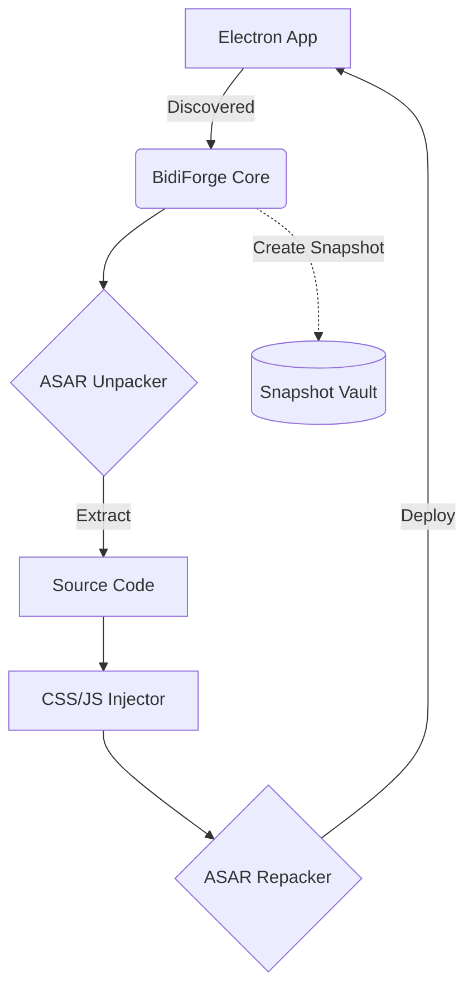

<div align="center">

# 🪬 BidiForge

**Universal BiDi Compatibility Layer for Electron Applications**

[](https://github.com/Jenzo0/BidiForge)
[](https://nodejs.org/)
[](https://microsoft.com/windows)
[](https://opensource.org/licenses/MIT)

*A robust Windows CLI tool that patches Electron applications to render Arabic & RTL text perfectly.*

</div>

## 🌐 The Problem
Most modern desktop apps are built using Electron, but many of them fail to properly support Right-to-Left (RTL) text rendering and Bidirectional (BiDi) text out of the box. This causes Arabic text to appear disjointed or backwards.

## 🛠️ The Solution: BidiForge
BidiForge is a sophisticated CLI tool that automatically scans your system for Electron apps and surgically injects RTL CSS and JS patches directly into the app's ASAR archives—without breaking the app.

---

## ✨ Features

- **🔍 Auto-Discovery**: Scans and detects all installed Electron apps automatically.
- **💉 Smart Patcher**: Injects BiDi/RTL CSS + JS via safe ASAR modification.
- **🛡️ Safe Updates**: Auto-repairs patches if an app vendor update overwrites them.
- **🕰️ Snapshot Vault**: Multi-version snapshot vault for instant rollback and restore.
- **🔥 Live Hot-Reload Watcher**: Applies patches in real-time as you tweak configurations.
- **🖱️ Explorer Integration**: Right-click context menu integration in Windows Explorer.
- **🏥 Health Inspector**: Full diagnostic suite to check app integrity and patch status.
- **🎨 Hermes Agent TUI**: A beautiful terminal user interface with themed cards, animated spinners, and arrow key navigation.
- **🌈 Multiple Themes**: Choose from Cyberpunk Cyan, Monokai, Solarized, and more!

---

## 🚀 Quick Start

### Prerequisites
- Windows 10/11
- [Node.js](https://nodejs.org/) (v16 or higher)

### Installation

```bash
# Clone the repository
git clone https://github.com/Jenzo0/BidiForge.git

# Navigate to the project directory
cd BidiForge

# Install dependencies
npm install

# Run BidiForge
node index.js
```

---

## 📸 Screenshots

> *Screenshots coming soon...*
>
> <!-- TODO: Add screenshot of Hermes Agent TUI here -->
> <!-- TODO: Add screenshot of before/after Arabic text rendering here -->

*Before BidiForge:* `م ر ح ب ا`
*After BidiForge:* `مرحبا`

---

## 💡 Usage Examples

BidiForge provides an intuitive, keyboard-driven CLI. You can also run it with direct commands:

```bash
# Launch the main Hermes Agent TUI
node index.js

# Scan for installed Electron applications
node index.js --scan

# Patch a specific application
node index.js --patch "C:\Path\To\App.exe"

# Rollback to the previous working state
node index.js --rollback "C:\Path\To\App.exe"

# Run a full diagnostic health check
node index.js --health

# Start the Hot-Reload watcher for live patching
node index.js --watch
```

---

## 🏗️ Architecture Overview

BidiForge operates by unpacking Electron's `app.asar` archive, injecting necessary RTL stylesheets and bidirectional text scripts, and safely repacking the archive.

<details>
<summary>Click to view architecture diagram</summary>



</details>

---

## 🤝 Contributing

Contributions are what make the open source community such an amazing place to learn, inspire, and create. Any contributions you make are **greatly appreciated**.

1. Fork the Project
2. Create your Feature Branch (`git checkout -b feature/AmazingFeature`)
3. Commit your Changes (`git commit -m 'Add some AmazingFeature'`)
4. Push to the Branch (`git push origin feature/AmazingFeature`)
5. Open a Pull Request

Please read our [CONTRIBUTING.md](CONTRIBUTING.md) for details on our code of conduct, and the process for submitting pull requests.

---

## 📄 License

Distributed under the MIT License. See `LICENSE` for more information.

---

## 💖 Credits

Developed and maintained with passion by **[Jenzo0](https://github.com/Jenzo0)**.

<div align="center">
  <i>"Forging a better web for everyone, right to left."</i>
</div>
